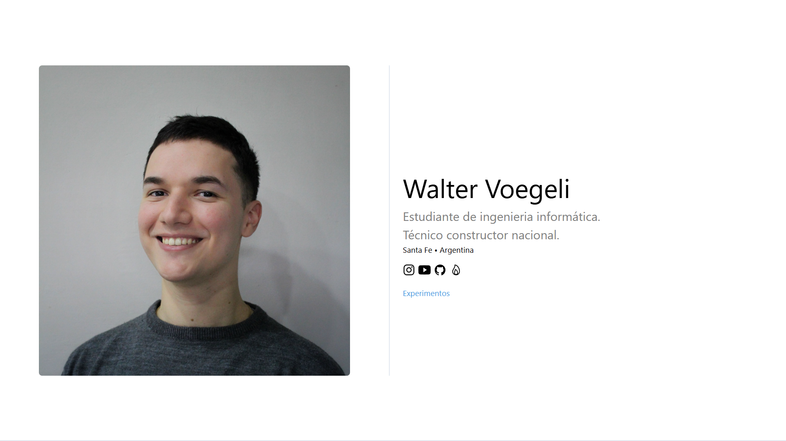

# 📌 Modelo de portafolio web

---

## 📝 Descripción
Proyecto web básico que habia hecho para aprender diseño estático.  

---

## 🛠 Tecnologías Utilizadas
- Lenguaje: **html/css/js.**  
- Librerías: **-**  
- Herramientas: **VS code, Github**
